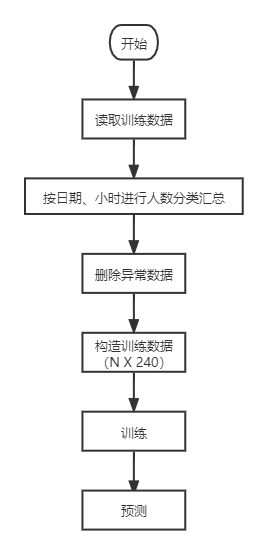
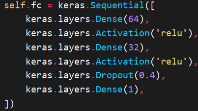
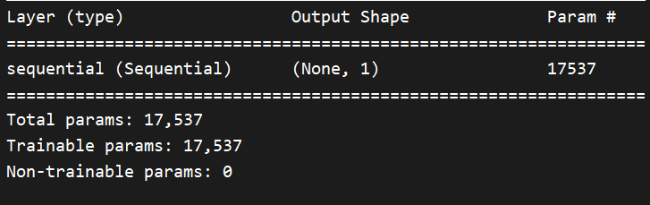

# 海南大学-高级软件工程第五组

## 本组成员

- 梁浚延
- 郭禹
- 杨峰

## 算法流程

> **什么是异常数据**
>
> 在我们的算法中，异常数据被定义为**上一小时人数与当前小时人数之差大于某一阈值，就将当前小时数据视为异常数据**。这一阈值的设定取决于计算得到的异常数据比例，默认为**`10%`**。例如，当设定阈值为80时，训练集中上一小时与当前小时之差>80的数据共有235条，近似于设定的异常数据比例10%

## 模型结构

